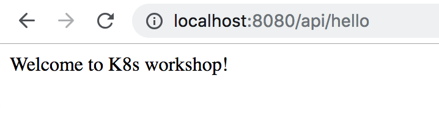
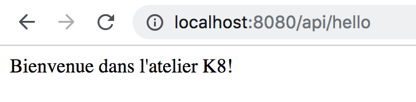
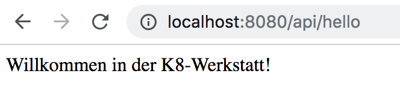

<md-icon class="fa fa-clock-o fa-lg" aria-hidden="true"></md-icon> Time to complete 30ms

<i class="fa fa-info-circle fa-lg" aria-hidden="true" style="color:dark-blue"></i>
ConfigMaps bind configuration files, command-line arguments, environment variables, port numbers, and other configuration artifacts to your Pods' containers and system components at runtime. ConfigMaps allow you to separate your configurations from your Pods and components, which helps keep your workloads portable, makes their configurations easier to change and manage, and prevents hardcoding configuration data to Pod specifications.
ConfigMaps are useful for storing and sharing non-sensitive, unencrypted configuration information

In this exercise, we shall cover the following operations using K8s
manifests,

<ul class="fa-ul">
  <li><i class="fa-li fa fa-square"></i><b>Externalize Config Properties as environment variables</b></li>
  <li><i class="fa-li fa fa-square"></i><b>Externalize Config Properties as Files</b></li>
</ul>

<i class="fa fa-info-circle" aria-hidden="true"></i> Will install all the objects to the *default* namespace.

# Deployment

## Create a Deployment

**List the deployments in the default namespace.**

``` go-cli
kubectl get deploy
```

<i class="fa fa-spinner fa-pulse fa-fw"></i>
The output will be similar to this,

    No resources found.

Create a new Deployment by running the manifest <i class="fa fa-check-circle" aria-hidden="true" style="color:green"></i> `kubectl apply -f 05-deploy-cm/01.Deployment.yaml`

{{codebase-file codebase="k8s-workshop" path="code/05-deploy-cm/01.Deployment.yaml" lang="yaml" ref="master" hidden="true"}}

**Verify the output**

    kubectl get deploy,rs,pods

<i class="fa fa-spinner fa-pulse fa-fw"></i>
The output will be similar to this

    NAME                                    DESIRED   CURRENT   UP-TO-DATE   AVAILABLE   AGE
    deployment.extensions/hello-k8s         1         1         1            0           2m16s
    
    NAME                                              DESIRED   CURRENT   READY     AGE
    replicaset.extensions/hello-k8s-846f7447f         1         1         0         2m16s
    
    NAME                                  READY     STATUS    RESTARTS   AGE
    pod/hello-k8s-846f7447f-znb58         1/1       Running   1          2m16s

**Get the pod reference id from the above command and run the following**

`kubectl port-forward hello-k8s-846f7447f-znb58 8080`

**Verify the output in a browser**

`http://localhost:8080/api/hello`

The output will be similar to this



Press Control+C (linux) / Command+C (MacOS) to exit kubectl port-forward

## Update a Deployment

### Externalize Config - ENV Variables

In this, we will externalize application configuration info in a _ConfigMap_ object and then inject as env variables to the deployment by referring from the ConfigMap object

Update the Deployment by running the manifest <i class="fa fa-check-circle" aria-hidden="true" style="color:green"></i> `kubectl apply -f 05-deploy-cm/02.Deployment-config-prop.yaml`

{{codebase-file codebase="k8s-workshop" path="code/05-deploy-cm/02.Deployment-config-prop.yaml" lang="yaml" ref="master" hidden="true"}}

**Verify the output**

    kubectl get deploy,rs,pods,configmap

<i class="fa fa-spinner fa-pulse fa-fw"></i>
The output will be similar to this

```
    NAME                              READY   UP-TO-DATE   AVAILABLE   AGE
    deployment.extensions/hello-k8s   1/1     1            1           2s
    
    NAME                                       DESIRED   CURRENT   READY   AGE
    replicaset.extensions/hello-k8s-8fb7d649   1         1         1       2s
    
    NAME                           READY   STATUS    RESTARTS   AGE
    pod/hello-k8s-8fb7d649-mpss2   1/1     Running   0          2s
    
    NAME                  DATA   AGE
    configmap/hello-k8s   1      2s
```

We have defined a separate _ConfigMap_ to hold the key/value pairs,

```
data:
  hello.folks: "Bienvenue dans l'atelier K8!"
```

_hello.folks_ is injected as env variable to the _Deployment_ object by referring from the _ConfigMap_ object,

```
env:
  - name: hello.folks
    valueFrom:
      configMapKeyRef:
        key: hello.folks
        name: hello-k8s
```

Same property is also referred in the *spring-boot humourmind/hello-k8s-world:1.0.0* application.

**Get the pod reference id and run the following**

`kubectl port-forward hello-k8s-8fb7d649-mpss2 8080`

**Verify the output in a browser**

`http://localhost:8080/api/hello`

The output will be similar to this



This time _hello.folks_ property is referred from the _ConfigMap_ object key

Press Control+C (linux) / Command+C (MacOS) to exit kubectl port-forward

### Externalize Config - as File Volume mount

In this, we will externalize application configuration in a _ConfigMap_ object and then refer as a file through a volume mount

Update the Deployment by running the manifest <i class="fa fa-check-circle" aria-hidden="true" style="color:green"></i> `kubectl apply -f 05-deploy-cm/03.Deployment-config-file.yaml`

{{codebase-file codebase="k8s-workshop" path="code/05-deploy-cm/03.Deployment-config-file.yaml" lang="yaml" ref="master" hidden="true"}}

**Verify the output**

    kubectl get deploy,rs,pods,configmap

<i class="fa fa-spinner fa-pulse fa-fw"></i>
The output will be similar to this

```
    NAME                              READY   UP-TO-DATE   AVAILABLE   AGE
    deployment.extensions/hello-k8s   1/1     1            1           5m14s
    
    NAME                                        DESIRED   CURRENT   READY   AGE
    replicaset.extensions/hello-k8s-8fb7d649    0         0         0       5m14s
    replicaset.extensions/hello-k8s-977cc59bf   1         1         1       11s
    
    NAME                            READY   STATUS    RESTARTS   AGE
    pod/hello-k8s-977cc59bf-mvh9v   1/1     Running   0          11s
    
    NAME                  DATA   AGE
    configmap/hello-k8s   1      5m14s
```

We have defined config props in _application.properties_ in _ConfigMap_ object

```
data:
  application.properties: |-
    hello.folks: Willkommen in der K8-Werkstatt!
```

We have referred the property file as a volume mount in the main _Deployment_ object,

```
    volumeMounts:
      - mountPath: /config
        name: prop-file
  volumes:
    - name: prop-file
      configMap:
        name: hello-k8s
        items:
          - key: application.properties
            path: application.properties
```

spring boot will look for application.properties under $APP_HOME/config in a docker container and in this case APP_HOME will be '/'. Hence the mount point /config/application.properties file will be picked-up automatically by boot.

**Get the pod reference id and run the following**

`kubectl port-forward hello-k8s-977cc59bf-mvh9v 8080`

**Verify the output in a browser**

`http://localhost:8080/api/hello`

The output will be similar to this




This time properties are referred from application.properties file mount

Press Control+C (linux) / Command+C (MacOS) to exit kubectl port-forward


#### Clean-up

Run the script <i class="fa fa-undo" aria-hidden="true" style="color:red"></i> `05-deploy-cm/_1.clean.sh` to undo the changes

{{codebase-file codebase="k8s-workshop" path="code/05-deploy-cm/_1.clean.sh" lang="bash" ref="master" hidden="true"}}


# Wrap-up
<ul class="fa-ul">
  <li><i class="fa-li fa fa-check-square"></i><b>Externalize Config Properties as environment variables</b></li>
  <li><i class="fa-li fa fa-check-square"></i><b>Externalize Config Properties as Files</b></li>
</ul>
