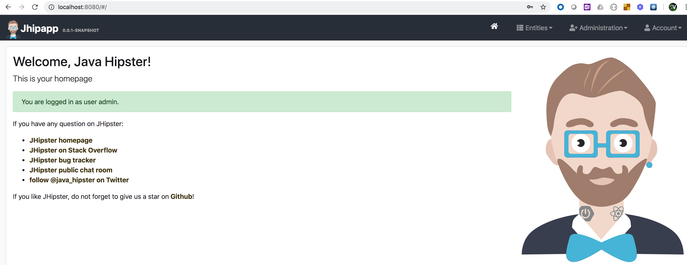

<md-icon class="fa fa-clock-o fa-lg" aria-hidden="true"></md-icon> Time to complete 30ms

<i class="fa fa-info-circle fa-lg" aria-hidden="true" style="color:dark-blue"></i>
The idea of a Service is to group a set of Pod endpoints into a single resource. You can configure various ways to access the grouping. By default, you get a stable cluster IP address that clients inside the cluster can use to contact Pods in the Service. A client sends a request to the stable IP address, and the request is routed to one of the Pods in the Service.
A Service identifies its member Pods with a selector. For a Pod to be a member of the Service, the Pod must have all of the labels specified in the selector. A label is an arbitrary key/value pair that is attached to an object.

In this exercise, we shall cover the following operations using K8s
manifests,

<ul class="fa-ul">
  <li><i class="fa-li fa fa-square"></i><b>Multiple App Deployments with Service Discovery</b></li>
  <li><i class="fa-li fa fa-square"></i><b>App2App Comm using internal native discovery</b></li>
</ul>

<i class="fa fa-info-circle" aria-hidden="true"></i> Will install all the objects to the *default* namespace.

# Multi-Deployment

## Create a Multi-App Deployment

**List the deployments in the default namespace.**

``` go-cli
kubectl get deploy
```

<i class="fa fa-spinner fa-pulse fa-fw"></i>
The output will be similar to this,

    No resources found.

Create a new multi-app Deployment by running the manifest <i class="fa fa-check-circle" aria-hidden="true" style="color:green"></i> `kubectl apply -f 06-deploy-svc/01.Service-Discovery.yaml`

{{codebase-file codebase="k8s-workshop" path="code/06-deploy-svc/01.Service-Discovery.yaml" lang="yaml" ref="master" hidden="true"}}

**Verify the output**

    kubectl get deploy,rs,pods

<i class="fa fa-spinner fa-pulse fa-fw"></i>
The output will be similar to this

```
    NAME                                       READY   UP-TO-DATE   AVAILABLE   AGE
    deployment.extensions/jhipapp              1/1     1            1           7s
    deployment.extensions/jhipapp-postgresql   1/1     1            1           7s
    
    NAME                                                  DESIRED   CURRENT   READY   AGE
    replicaset.extensions/jhipapp-54ffccccd5              1         1         1       7s
    replicaset.extensions/jhipapp-postgresql-79bf48fbc8   1         1         1       7s
    
    NAME                                      READY   STATUS    RESTARTS   AGE
    pod/jhipapp-54ffccccd5-vq2k8              1/1     Running   0          7s
    pod/jhipapp-postgresql-79bf48fbc8-ltgkr   1/1     Running   0          7s
```

We have deployed two apps and hence the output shows two different pod references. In this app `pod/jhipapp-54ffccccd5-vq2k8` uses postgres `pod/jhipapp-postgresql-79bf48fbc8-ltgkr` service as the back-end persistent store.

**Get the app pod reference id from the above command and run the following**

`kubectl port-forward jhipapp-54ffccccd5-vq2k8 8080`

**Verify the output in a browser**

`http://localhost:8080`

The output will be similar to this



Log-in with `admin/admin` and try CRUD operations. Changes will be referenced from the postgres `pod/jhipapp-postgresql-79bf48fbc8-ltgkr` backing store.

## Native Service Discovery

<i class="fa fa-info-circle fa-lg" aria-hidden="true" style="color:dark-blue"></i>
In a cluster, each Pod has an internal IP address. But the Pods in a Deployment come and go, and their IP addresses change. So it doesn't make sense to use Pod IP addresses directly. With a Service, you get a stable IP address that lasts for the life of the Service, even as the IP addresses of the member Pods change.
A Service also provides load balancing. Clients call a single, stable IP address, and their requests are balanced across the Pods that are members of the Service.

If you look at the _Deployment_ manifest,

```
      containers:
        - name: jhipapp-app
          image: humourmind/jhipapp:1.0.0
          env:
            - name: SPRING_PROFILES_ACTIVE
              value: prod
            - name: SPRING_DATASOURCE_URL
              value: jdbc:postgresql://jhipapp-postgresql:5432/jhipapp
            - name: SPRING_DATASOURCE_USERNAME
              value: jhipapp
            - name: SPRING_DATASOURCE_PASSWORD
              value: rla00jpp
            - name: JAVA_OPTS
              value: " -Xmx256m -Xms256m"
```
*SPRING_DATASOURCE_URL* is constructed using a DNS name, instead of POD IP of the postgres. In addition to _Deployment_ object, we have also created _Service_ objects for the apps.

**Run the below command**

`kubectl get svc -o wide`

<i class="fa fa-spinner fa-pulse fa-fw"></i>
The output will be similar to this

```
    NAME                 TYPE        CLUSTER-IP       EXTERNAL-IP   PORT(S)    AGE   SELECTOR
    jhipapp              ClusterIP   10.99.75.206     <none>        8080/TCP   12m   app=jhipapp
    jhipapp-postgresql   ClusterIP   10.109.178.197   <none>        5432/TCP   12m   app=jhipapp-postgresql
```

Service object `jhipapp` identifies its member Pods with a selector `app=jhipapp`. With Service object you get a stable cluster IP address (+ Internal DNS) that clients inside the cluster can use to contact Pods in the Service.

**If you query the deployment object**

`kubectl get deployment/jhipapp -o jsonpath="{.spec.template.metadata.labels}"`

The output will be similar to this

`map[app:jhipapp]`

This is the same label that is filtered through Services's Selector. **jhipapp-postgresql**/**jhipapp-postgresql.default.svc.cluster.local** is the internal DNS of postgres `pod/jhipapp-postgresql-79bf48fbc8-ltgkr` POD.

> Press Control+C (linux) / Command+C (MacOS) to exit kubectl port-forward

### Clean-up

Run the script <i class="fa fa-undo" aria-hidden="true" style="color:red"></i> `06-deploy-svc/_1.clean.sh` to undo the changes

{{codebase-file codebase="k8s-workshop" path="code/06-deploy-svc/_1.clean.sh" lang="bash" ref="master" hidden="true"}}


#Wrap-up
<ul class="fa-ul">
  <li><i class="fa-li fa fa-square"></i><b>Multiple App Deployments with Service Discovery</b></li>
  <li><i class="fa-li fa fa-square"></i><b>App2App Comm using internal native discovery</b></li>
</ul>
