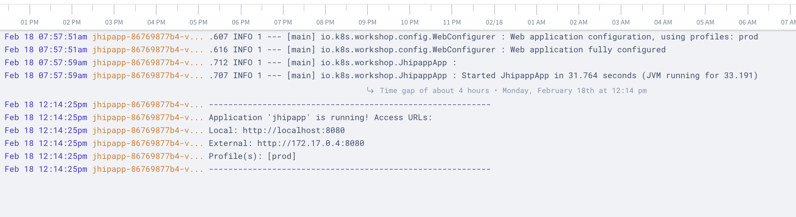

<md-icon class="fa fa-clock-o fa-lg" aria-hidden="true"></md-icon> Time to complete 30ms

<i class="fa fa-info-circle fa-lg" aria-hidden="true" style="color:dark-blue"></i>
A Pod might encapsulate an application composed of multiple co-located containers that are tightly coupled and need to share resources. These co-located containers might form a single cohesive unit of service–one container serving files from a shared volume to the public, while a separate “sidecar” container refreshes or updates those files. The Pod wraps these containers and storage resources together as a single manageable entity.
Of late side care pattern is becoming lot more popular for security, log management, routing etc.

In this exercise, we shall cover the following operations using K8s
manifests,

<ul class="fa-ul">
  <li><i class="fa-li fa fa-square"></i><b>Create a Deployment with Sidecar</b></li>
  <li><i class="fa-li fa fa-square"></i><b>Log Management using Sidecar</b></li>
</ul>

<i class="fa fa-info-circle" aria-hidden="true"></i> Will install all the objects to the *default* namespace.

# Sidecar: Multi-Container Pod

## Create a Deployment with Sidecar

**List the deployments in the default namespace**

``` go-cli
kubectl get deploy
```

<i class="fa fa-spinner fa-pulse fa-fw"></i>
The output will be similar to this,

    No resources found.

Create a new Deployment by running the script <i class="fa fa-check-circle" aria-hidden="true" style="color:green"></i> `kubectl apply -f 10-deploy-multicon/1_.apply.sh`

{{codebase-file codebase="k8s-workshop" path="code/10-deploy-multicon/1_.apply.sh" lang="yaml" ref="master" hidden="true"}}

**Verify the output**

    kubectl get deploy,rs,pods

<i class="fa fa-spinner fa-pulse fa-fw"></i>
The output will be similar to this

```
    NAME                                       READY   UP-TO-DATE   AVAILABLE   AGE
    deployment.extensions/jhipapp              1/1     1            1           11m
    deployment.extensions/jhipapp-postgresql   1/1     1            1           11m
    
    NAME                                                  DESIRED   CURRENT   READY   AGE
    replicaset.extensions/jhipapp-86769877b4              1         1         1       11m
    replicaset.extensions/jhipapp-postgresql-5878d786f8   1         1         1       11m
    
    NAME                                      READY   STATUS    RESTARTS   AGE
    pod/jhipapp-86769877b4-fsmmh              2/2     Running   2          11m
    pod/jhipapp-postgresql-5878d786f8-jccmk   1/1     Running   0          11m
```    

## Log Management using Sidecar

If you look at the app pod `pod/jhipapp-86769877b4-fsmmh`, it has two containers. In this we are running logging as a sidecar container
that collects app container's log.

Run the below command,

`kubectl get pod/jhipapp-86769877b4-fsmmh -o jsonpath="{.spec.containers[*].name}"`

<i class="fa fa-spinner fa-pulse fa-fw"></i>
The output will be similar to this, will list both containers in the pod,

`jhipapp-app timber-agent%`

If you inspect the content of the containers,

```
        - name: jhipapp-app
          image: humourmind/jhipapp:1.0.0
          env:
            - name: JAVA_OPTS
              value: " -Xmx256m -Xms256m"
            - name: LOGGING_PATH
              value: /var/log/
              

        - name: timber-agent
          image: "timberio/agent:0.8.1"
          args: ["capture-files", "-c", "/timber/config.toml"]
          volumeMounts:
            - name: sidecar-log-agent-config-map
              mountPath: /timber
              readOnly: true
            - name: logging-app-log-dir
              mountPath: /var/log/              
```

app container is writing to /var/log/ and the logging sidecar is reading the log from the same path and streaming to the cloud service.


**Run the below command to check the status of log streaming to the cloud service**

`kubectl logs pod/jhipapp-86769877b4-vkzhg -c timber-agent`

<i class="fa fa-spinner fa-pulse fa-fw"></i>
The output will be similar to this

```
time="2019-02-18T02:27:37Z" level=info msg="Disovered new file from /var/log/spring.log -> /var/log/spring.log"
time="2019-02-18T02:27:37Z" level=info msg="Received file /var/log/spring.log, attempting to foward"
time="2019-02-18T02:27:37Z" level=info msg="Starting forward for file /var/log/spring.log"
time="2019-02-18T02:27:37Z" level=info msg="Creating new file tailer for /var/log/spring.log"
time="2019-02-18T02:27:37Z" level=warning msg="Could not load state for file /var/log/spring.log, agent will recognize new data only"
time="2019-02-18T02:27:37Z" level=info msg="Seeked /var/log/spring.log - &{Offset:0 Whence:2}\n"
2019/02/18 02:27:52 [DEBUG] POST https://logs.timber.io/frames
time="2019-02-18T02:27:54Z" level=info msg="flushed buffer (status code 202)"
2019/02/18 02:28:01 [DEBUG] POST https://logs.timber.io/frames
time="2019-02-18T02:28:03Z" level=info msg="flushed buffer (status code 202)"
```

The output will be similar to this if you log-in to timber.io



### Clean-up

Run the script <i class="fa fa-undo" aria-hidden="true" style="color:red"></i> `10-deploy-multicon/_1.clean.sh` to undo the changes

{{codebase-file codebase="k8s-workshop" path="code/10-deploy-multicon/_1.clean.sh" lang="bash" ref="master" hidden="true"}}

# Wrap-up
<ul class="fa-ul">
  <li><i class="fa-li fa fa-check-square"></i><b>Create a Deployment with Sidecar</b></li>
  <li><i class="fa-li fa fa-check-square"></i><b>Log Management using Sidecar</b></li>
</ul>
