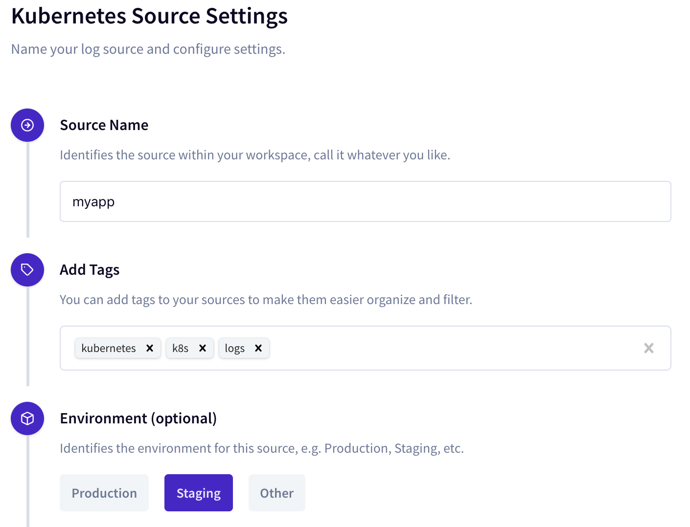
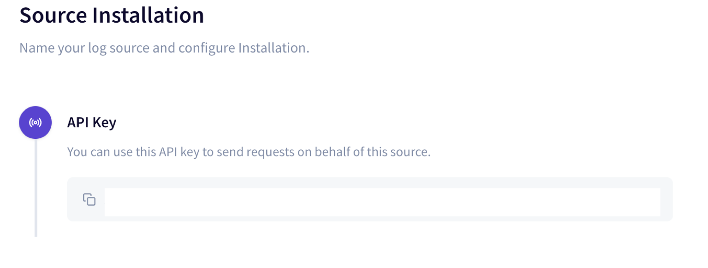

<md-icon class="fa fa-clock-o fa-lg" aria-hidden="true"></md-icon> Time to complete 15ms


# Setting up environment variables

<i class="fa fa-info-circle fa-lg" aria-hidden="true" style="color:dark-blue"></i>
Run the below command in a terminal window and use the same window for running rest of the exercises 


## Set NODE_NAME
**Verify the cluster status**

``` go-cli
kubectl cluster-info
```

<i class="fa fa-spinner fa-pulse fa-fw"></i>
The output will be similar to this indicating the cluster is healthy and running,

```
Kubernetes master is running at https://192.168.64.5:8443
KubeDNS is running at https://192.168.64.5:8443/api/v1/namespaces/kube-system/services/kube-dns:dns/proxy

To further debug and diagnose cluster problems, use 'kubectl cluster-info dump'.

```
<i class="fa fa-exclamation-circle fa-lg" aria-hidden="true" style="color:maroon"></i>
Check with the instructors if you find error/exception with the above command.


**List the nodes in your cluster.**

``` go-cli
kubectl get nodes -o wide
```

<i class="fa fa-spinner fa-pulse fa-fw"></i>
The output will be similar to this,

    NAME       STATUS    ROLES     AGE       VERSION
    vm-1234    Ready     <none>    35h       v1.12.4
    vm-4567    Ready     <none>    35h       v1.12.4

Get the name of one of the nodes and initialize _NODE_NAME_ environment variable

`export NODE_NAME=vm-1234`


## Set TIMBER_API_KEY

- Sign-up at `https://app.timber.io/auth` with github/google/custom info**


- Add a new app and select Kubernetes from the list**


- Populate source info and click next



- Copy the _API Key_ and initialize _TIMBER_API_KEY_ with the value



`export TIMBER_API_KEY=xxxx-yyyy-zzzz-aaaa-bbbb`

